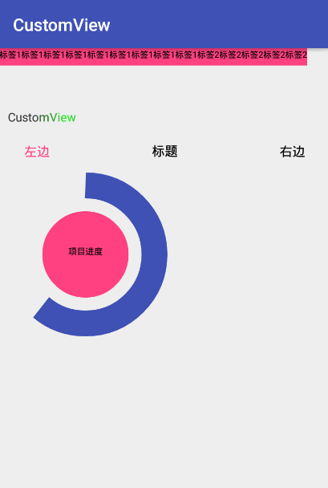

## 自定义View合集
## 截图示例

## 1. FlowLayout    流式布局

### 使用方法:
#### (1) 直接在布局文件中写入子元素

```
<com.codekong.customview.view.FlowLayout
        android:id="@+id/id_fl"
        android:layout_width="match_parent"
        android:layout_height="60dp">
        <TextView
            android:layout_width="wrap_content"
            android:layout_height="20dp"
            android:text="签1标签1标签1标签1标签1"
            android:textSize="10sp"
            android:textColor="#000000"
            android:background="@color/colorAccent"
            android:layout_margin="5dp"
            android:gravity="center"/>
        <TextView
            android:layout_width="wrap_content"
            android:layout_height="20dp"
            android:text="标签2标签2标签2标签2标签2"
            android:textSize="10sp"
            android:textColor="#000000"
            android:background="@color/colorAccent"
            android:layout_margin="5dp"
            android:gravity="center"/>
        <TextView
            android:layout_width="wrap_content"
            android:layout_height="20dp"
            android:text="标签3标签3标签3"
            android:textSize="10sp"
            android:textColor="#000000"
            android:background="@color/colorAccent"
            android:layout_margin="5dp"
            android:gravity="center"/>
</com.codekong.customview.view.FlowLayout>
```

#### (2) 通过addView()添加子元素

```
FlowLayout fl = (FlowLayout) findViewById(R.id.id_fl);
fl.addView(childView);
```

## 2. TextFlashingTextView    文字闪动变色TextView
### 使用方法:
```
<com.codekong.customview.view.TextFlashingTextView
        android:id="@+id/mytv"
        android:layout_width="wrap_content"
        android:layout_height="wrap_content"
        android:layout_marginTop="10dp"
        android:layout_marginLeft="10dp"
        android:text="@string/app_name" />
```

#### 可配置属性:
TextView的所有属性

## 3. TopBar    高度可定制TopBar
### 使用方法:

```
<com.codekong.customview.view.TopBar
        android:layout_width="match_parent"
        android:layout_height="40dp"
        android:layout_marginTop="10dp"
        app:leftText="左边"
        app:leftTextColor="@color/colorAccent"
        app:rightText="右边"
        app:title="标题">
</com.codekong.customview.view.TopBar>
```
#### 可配置属性:
```
title                       ----------  TopBar的标题
titleTextSize               ----------  TopBar的标题字体大小
titleTextColor              ----------  TopBar的标题字体颜色
leftText                    ----------  TopBar的左边按钮标题
leftTextSize                ----------  TopBar的左边按钮标题字体大小
leftTextColor               ----------  TopBar的左边按钮标题字体颜色
leftBackground              ----------  TopBar的左边按钮标题的背景
rightText                   ----------  TopBar的右边按钮标题
rightTextSize               ----------  TopBar的右边按钮标题字体大小
rightTextColor              ----------  TopBar的右边按钮标题字体颜色
rightBackground             ----------  TopBar的右边按钮标题的背景
```
#### 代码设置:
```
TopBar topBar = (TopBar) findViewById(R.id.id_topbar);
//设置TopBar左右按钮的点击事件
topBar.setTopbarClickListener(new TopBar.TopbarClickListener() {
    @Override
    public void leftClick(View v) {
        //左边按钮点击事件
    }

    @Override
    public void rightClick(View v) {
        //右边按钮点击事件
    }
});

//显示左边按钮
topBar.setBtnVisibility(0, true);
//隐藏右边按钮
topBar.setBtnVisibility(1, false);
```

## 4. 百分比图示
### 使用方法:
```
<com.codekong.customview.view.PercentageGraph
    android:layout_width="200dp"
    android:layout_height="200dp"
    app:innerCircleColor="@color/colorAccent"
    app:outerCircleColor="@color/colorPrimary"
    app:outerCircleStrokeWidth="30dp"
    app:startAngle="270"
    app:sweepAngle="220"
    app:textSize="10sp"
    app:textContent="项目进度"/>
```
#### 可配置属性
```
innerCircleColor                ----------   内圆的颜色
outerCircleColor                ----------   外圆(弧线)的颜色
outerCircleStrokeWidth          ----------   外圆(弧线)的宽度
textColor                       ----------   内部文字的颜色
textSize                        ----------   内部文字的字体大小
textContent                     ----------   内部文字的内容
startAngle                      ----------   外圆(弧线)的开始角度
sweepAngle                      ----------   外圆(弧线)的扫过的角度
```

## 5. 音频条形图
### 使用方法:
```
<com.codekong.customview.view.AudioBarGraph
    android:id="@+id/id_abg"
    android:layout_width="match_parent"
    android:layout_height="wrap_content"
    app:rectCount="20"/>
```
#### 可配置属性
```
rectCount       ----------   小矩形的数目
rectOffset      ----------   每一个小矩形之间的偏移量
topColor        ----------   一个小矩形渐变的顶部颜色
bottomColor     ----------   一个小矩形渐变的顶部颜色
delayTime       ----------   小矩形变化的延时时间(毫秒)
```
#### 可配置属性:
```
AudioBarGraph audioBarGraph = (AudioBarGraph) findViewById(R.id.id_abg);
float[] m = new float[20];
for (int i = 0; i < m.length; i++) {
    m[i] = (float) (Math.random() * 100);
}
//通过代码设置每个小矩形的当前高度,使其高度动态变化
audioBarGraph.setCurrentHeight(m);
```
